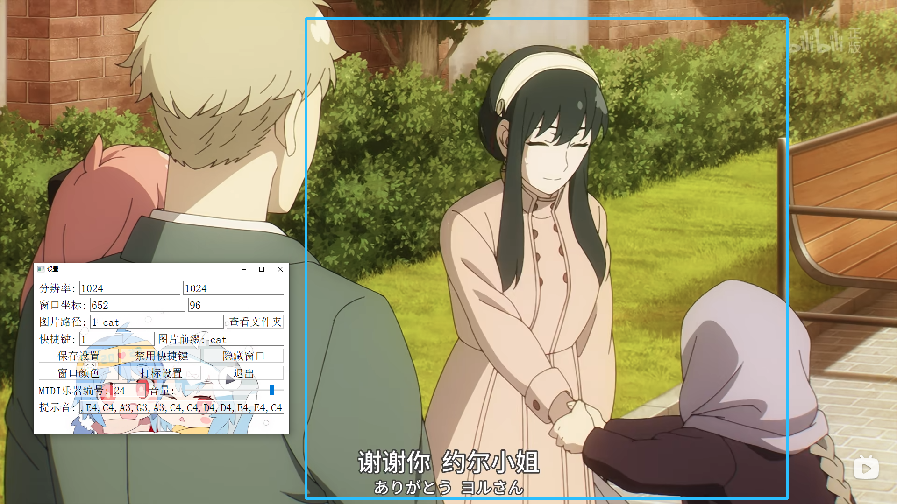

# 截图小工具

* 能快速轻松按设定分辨率和位置截取图片,特别适合快速截取 游戏/视频/图片 中的一部分作为模型训练素材.
* 能快速设定截图路径和图片前缀,目录结构符合sd-scripts

# 使用说明简略版

1. 下载[/抓图.py](/抓图.py) 到你的训练素材目录，比如 `d:/训练素材`。(也可以放在任意目录,但截图路径需要填绝对路径)
2. 双击打开 `抓图.py`，设置图片路径（可用文件夹名或绝对路径, 设置图片前缀，按住shift移动鼠标移动截图窗口到合适位置
3. 按键盘数字键 1 截图，听到提示音则截图成功，默认路径为当前**抓图.py**文件所在文件夹。

## 图片展示



## 其他可用功能和快捷键（设置窗口内生效）

### 移动抓图窗口

- 在激活设置窗口或者抓图窗口的情况下**按住 shift** **移动鼠标** 可以移动抓图窗口。也可以拖拽抓图窗口边缘移动.

### 图片浏览

1. 拖拽任意图片文件到设置窗口可以修改背景图，按 V 重设窗口大小适应图片大小，右键单击设置窗口隐藏/显示所有控件。
2. 按 A 切换背景图目录中上一张图片，按 F 切换下一张图片(只识别jpg和png)，双击设置窗口空白处能最大化设置窗口。
3. 按住 alt 上下滚动鼠标滚轮可以修改设置窗口透明度，需要注意透明度最低是 0.002，并不是完全透明，会对窗口背后的画面有污染,截图需要移开设置窗口.
4. 鼠标滚轮可以缩放设置窗口大小（缩放算法有点糟糕需要改进,应该修改设置窗口铺满全屏,然后只移动缩放图片可能效果会更好）。

### 关于声音提示

* 为了判断到底有没有成功截图加了个提示音功能,不喜欢可以把音量拉倒0或者注释掉相关代码
* 按截图快捷键后的提示音可自行修改,包括C0到B8的范围,支持升降调例如C#4,Cb4,用逗号隔开注意大小写.如果格式错误会播放固定音高F7
* midi乐器编号: https://blog.csdn.net/muyao987/article/details/106854562

### 文件保存和依赖库安装

1. 截图保存图片路径只填文件夹名为当前 py 文件所在目录，也可以填写绝对路径，比如 `d:/cat`，需要注意路径中斜杠最好用反斜杠/。
2. 每次抓图会检测当前前缀文件最大后缀和文件数量是否一致，后缀不连贯会自动重命名所有文件，比如你抓了几张图然后觉得其中一些不需要删除了，再抓图他会自动重命名所有文件保证文件名连续，如果你手动改过文件名可能会触发意料之外的bug。
3. 图片文件夹命名规则为: **数字_后缀**, 比如 **1_xdog** 或者 **6_xdog** 前面的数字代表在sd-scripts训练循环中每轮重复训练多少次这个文件夹中的图片.如果你不用sd-scripts训练可以任意命名文件夹.
4. 同一个图片路径中可以设置不同图片**前缀**,同一个文件夹中同一种图片前缀最多只能有9999个文件,建议不同类型的图放到不同文件夹.
5. 程序启动会自动检测依赖库是否安装并安装，如果你是在虚拟环境中执行可能会启动失败，需要先激活虚拟环境再命令行执行命令：`set "QT_PLUGIN_PATH=%VIRTUAL_ENV%\Lib\site-packages\PyQt5\Qt5\plugins"`，
6. 如果出现功能无效或者异常退出，大概率是触发了意料之外的 BUG，请自行 DEBUG。
7. 打标功能还未添加，未来会增加可视化打标功能。

## 注意事项

- 测试环境 python 3.10.6 和 3.11.1 都正常运行，其他的没试过。
- 分辨率需要是 64 的倍数，SD1.5默认512*512, *SDXL 默认 1024*1024。
- 默认抓图快捷键 1，大键盘和小键盘的 1 都行。
- 快捷键修改实时生效，如果输入的快捷键无效则不会更改快捷键。
- 支持单个键的快捷键，也支持任意数量组合的快捷键。
- 快捷键格式：快捷键 或者 快捷键+快捷键+快捷键...，比如 `s` 或者 `ctrl+s+d+alt`。
- 特殊键比如 `ctrl` `alt` `esc` `f1` `shift` 写法和键盘上的基本差不多，其他的自行查看 keyboard 库的文档。
- 正常退出会自动保存当前设置。
- keyboard 库是一个全局监听键盘按键的库，可能会被安全软件拦截。
- 只有截图快捷键是全局热键，其他的需要激活设置窗口才有效。
- 启动时默认会加载目录下background.jpg作为背景图,如果不存在会从https://www.bilibili.com/opus/623418398550389428下载一张

## 代码中资源默认路径可以自行查找修改

# 资源默认路径:存放background.jpg的路径

```python
# 资源默认路径:存放background.jpg的路径
RES_PATH = "P:/0P/lora训练/"
```

## 不想播放提示音,注释掉这部分

```python
搜索pygame注释或删除包含pygame的所有代码和下面的代码

# 播放音符
        try:
            # 使用split()方法将字符串转换为列表
            note = self.MUSIC_NOTES[self.note_index % len(self.MUSIC_NOTES)]
            midi_note = self.note_mapping[note]
            self.midi_out.set_instrument(self.MIDI乐器编号)  # 设置乐器编号，0 是钢琴
            self.midi_out.note_off(midi_note, self.velocity)  # 发送音符关闭消息
            self.midi_out.note_on(midi_note, self.velocity)  # 发送音符开启消息
        except:
            midi_note = self.note_mapping["F7"]
            self.midi_out.set_instrument(self.MIDI乐器编号)  # 设置乐器编号，0 是钢琴
            self.midi_out.note_off(midi_note, self.velocity)  # 发送音符关闭消息
            self.midi_out.note_on(midi_note, self.velocity)  # 发送音符开启消息
            pass

    # 更新音符索引
        self.note_index += 1
        if self.note_index>=len(self.MUSIC_NOTES):
            self.note_index=0
```

```python

```
